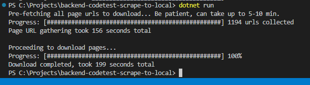

# Backend Codetest

Backend solution, console app in C# .NET Core

## Instructions

Create a console program in your language of choice that:
- Recursively traverses all pages on https://books.toscrape.com/
- Downloads and saves all files (pages, images…) to disk while keeping the file structure
- Shows some kind of progress information in the console

**Definition of done**

When your application has completed execution it should be possible to view the original
page locally on your computer.

**Constraints**

The focus of the challenge is the actual scraping. It’s OK to use external libraries for link
extraction and DOM parsing. Or you can roll your own if you’re feeling productive!

**Good to know**

On top of the basics, we do appreciate it if your program displays a good use of
*asynchronicity*, *parallelism* and *threading*.

## Commands

Install necessary packages `Install-Package HtmlAgilityPack`

Build: `dotnet build`

Run: `dotnet run`

## Packages used

- https://html-agility-pack.net/

## Notes and comments

- Not exactly efficient with gathering all the Page URLs in a first phase and then Downloading in a secondary phase, as technically I've already traversed each page (at least) once before.
    - But the assignment asked for progress indicators so now there's two versions (spinner and 0-100) 😅
    - A better version would simply report back how many have been downloaded with the spinner, or perhaps use a sitemap when available to determine how many pages there are to download...
- Downloaded files work locally, maintains file structure on disk
    - Can navigate any link
    - Images, scripts and styling are present
    - The thing that seems to be missing are icons... Showing up as squares instead but I've spent a reasonable amount of time for this so ending it where it is now.
- Parallellism/asynchronicity is in place, using ActionBlocks to post worker jobs (even recursively) and atomic operations to update the progress indicators.
- Threadsafe operations and failsafes are in place
    - There is a potential for a bug to appear and that is if multiple threads happen on to download the same resource (these were not indexed in a unique entries-only enumerable), but one of the threads will simply exception out and it will keep going.
- Could use some refactoring (classes/methods) but as I said with the time, ending it where it is now.
- The relative links were probably the most interesting challenge to account for 😄

## Result

